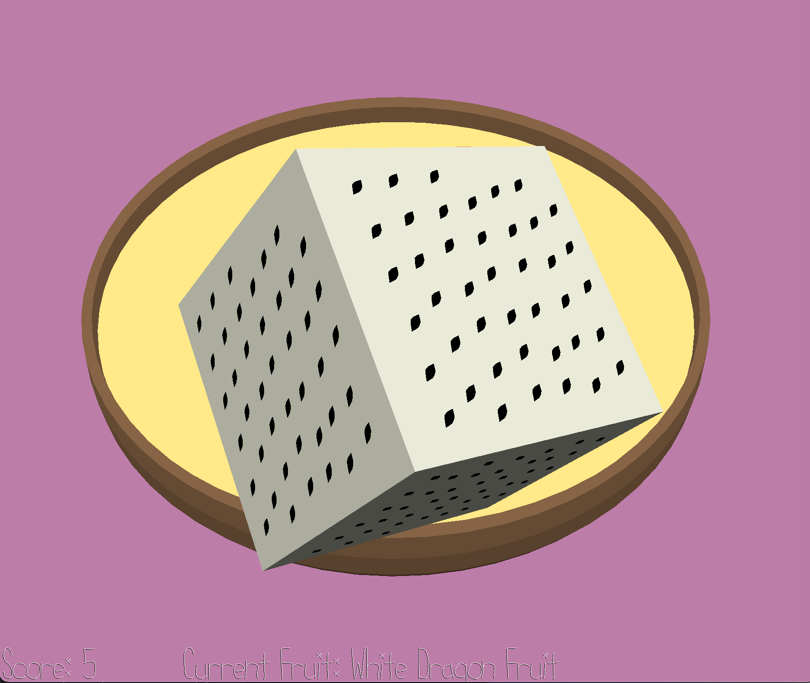

# Bakery Time!

Author: Emma Liu

Design: You're working in a bakery and need to fulfill some orders from some *peculiar* and *stressful* customers. Unlike in the last game, you are not to design your tart to your heart's desire. Instead, you must listen to their ever-changing preferences and make edits to your tart-in-progress as swiftly as possible!

Screen Shot:

How To Play:

You will be issued commands in a series of rounds. Each round, there will be a short pause prior to the customer expressing their preference, and then after they tell you their preference, you will have a short period (marked by stressful music) where you must edit your tart to their desire. If they indicate they want a fruit, you better keep it on/add it to the tart (+5). If they indicate they don't want a fruit, you must try to remove it from the tart if it's been placed, and you should replace all fruits you've had to removed in the process, otherwise you'll be penalized (-1 for each superfluously removed fruit). If you fail to remove the requested fruit (-5) and also removed existing fruits in the process, you'll be penalized even more for these superfluously removed fruits (-2).

Controls: To place fruits...
- SPACEBAR: Load fruit into staging zone (you can't rotate/place the piece until you do this)
- T: Toggle to set different fruit (among others not placed on tart yet)
- U: Undo placed moves (in LIFO order)
- Mouse click: Throw the fruit into the scene. It will roughly land where your cursor selected.

Sources:

- ["Relaxing Ballad"](https://freepd.com/upbeat.php) by Alexander Nakarada (Creative Commons 0 License)
- ["Epic Boss Battle"](https://freepd.com/epic.php) by Rafael Krux (Creative Commons 0 License)
- Various text command samples from [text2speech.org](text2speech.org), located in `dist/multiple/`

This game was built with [NEST](NEST.md).

